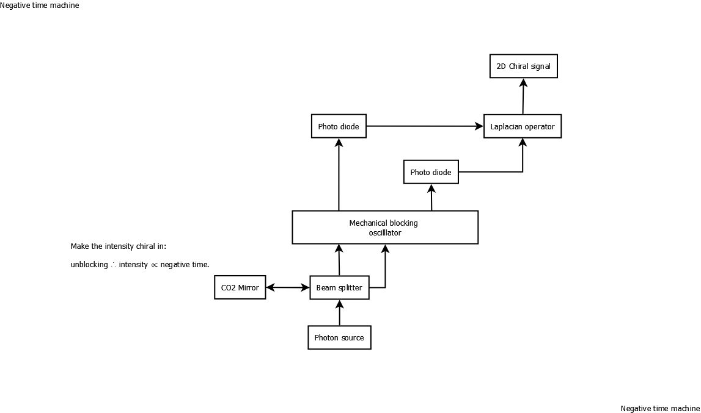

# Negative Time Machine

An experimental exploration of quantum chirality and its relationship to temporal phenomena through optical and mechanical interactions.



## Project Overview

This repository contains theoretical models, simulations, and experimental protocols for exploring "negative time" effects through manipulation of light intensity and chirality relationships. The project investigates whether quantum effects can produce signals with properties that appear to violate traditional temporal causality at small scales.

## Core Components

- **Photon Source**: High-coherence laser (532nm/1550nm)
- **Beam Splitter**: 50:50 dichroic with anti-reflection coating
- **CO₂ Mirror**: High-reflectivity dielectric mirror
- **Mechanical Blocking Oscillator**: Piezoelectric actuator (10kHz-1MHz)
- **Photo Diodes**: Silicon PIN with <1ns response time
- **Laplacian Operator**: Analog circuit for spatial derivatives
- **2D Chiral Signal Analyzer**: FPGA-based signal processing

## Principle of Operation

The system establishes a relationship between unblocking events and intensity that inversely correlates with conventional time flow, where:

```
unblocking ∝ intensity ∝ negative time
```

Light from the photon source travels through multiple paths including reflection from the CO₂ mirror and interaction with the mechanical blocking oscillator. The oscillator creates temporally modulated light patterns detected by photo diodes, processed by the Laplacian operator, and analyzed for 2D chiral signals.

## Repository Structure

```
/
├── models/              # Theoretical models and simulations
├── schematics/          # Circuit and optical path diagrams
├── simulations/         # Code for simulating quantum effects
├── data/                # Sample data from simulations
├── docs/                # Detailed documentation
└── papers/              # Related research papers
```

## Getting Started

1. Review the theoretical framework in `docs/framework.md`
2. Explore simulations in the `simulations/` directory
3. See `docs/setup.md` for experimental configuration guidelines

## Requirements

### Hardware
- Optical breadboard with vibration isolation
- Temperature-controlled enclosure (±0.1°C stability)
- Vacuum chamber for key optical components
- Precision optical mounts
- Shielded coaxial cables
- Stable power supplies

### Software
- Python 3.8+ with NumPy, SciPy, and Matplotlib
- Quantum optics simulation libraries
- Signal processing tools
- FPGA development environment

## Contributing

Contributions are welcome! Please read `CONTRIBUTING.md` for guidelines on how to submit contributions.

## License

This project is licensed under the MIT License - see the `LICENSE` file for details.

## Citation

If you use this work in your research, please cite:

```
@misc{negative-time-machine,
  author = {[George Wagenknecht]},
  title = {Negative Time Machine: Exploring Chirality and Quantum Effects},
  year = {2025},
  url = {https://github.com/gw67-alt/negative-time-machine}
}
```

## Disclaimer

This project explores theoretical physics concepts and does not claim to achieve actual time reversal or time travel. All experiments should be conducted with appropriate safety measures and in compliance with relevant regulations.
